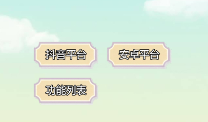
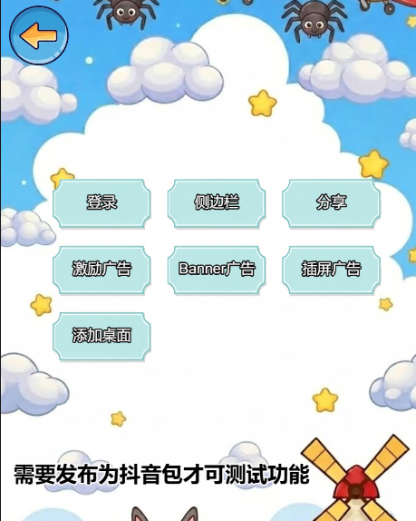

# Cocos RS Learn

一个基于 Cocos Creator 3.8.6 开发的 TypeScript 游戏框架学习项目，**核心聚焦于多平台小游戏（微信、抖音）的广告与平台功能集成**，提供一套平台功能开发解决方案示例。

## 🎮 功能演示

| 主界面 | 抖音平台功能 |
|--------|-------------|
|  |  |

## 项目特性

- **🎯 多平台统一接口**：一套代码适配微信小游戏、抖音小游戏，通过统一接口调用平台能力
- **📱 完整的广告系统**：支持 Banner、激励视频、插屏广告、原生模板广告等多种广告形式
- **🔗 平台能力集成**：分享、登录、桌面快捷方式、侧边栏跳转等平台专属功能
- **🌐 WebSocket 实时通信**：多人在线互动、数据实时同步、心跳保活、自动重连
- **🛠️ 完整的管理器系统**：UI、资源、事件、网络、存储、对象池等核心管理器
- **🔒 安全存储**：AES 加密的本地存储方案
- **📦 Bundle 资源管理**：基于 Cocos Creator 的 Bundle 资源管理系统
- **⚡ TypeScript 支持**：使用现代 TypeScript 语法，目标为 ES2022

## 技术栈

- **游戏引擎**：Cocos Creator 3.8.6
- **开发语言**：TypeScript (ES2022)
- **服务器**：Node.js + WebSocket (ws)
- **主要依赖**：
  - `crypto-es`: 用于 AES 加密存储
  - `ws`: WebSocket 服务器库
  - `uuid`: 唯一 ID 生成

---

## 🏆 核心：UI-pop 多平台功能演示模块

项目的核心展示模块位于 `assets/UI-pop/`，提供了直观的平台功能测试界面：

### UI-pop 模块结构

```
assets/UI-pop/
├── src/
│   ├── PopFuc.ts          # 功能列表面板（入口）
│   ├── PopDYPlatform.ts   # 抖音平台功能测试面板
│   └── PopNativePlatform.ts # Android原生功能测试面板
├── res/img/               # 界面资源图片
├── popFuc.prefab          # 功能列表预制体
├── popDYPlatform.prefab   # 抖音平台预制体
└── popNativePlatform.prefab # 原生平台预制体
```

### 功能面板说明

| 面板 | 功能 |
|------|------|
| **PopFuc** | 零碎功能展示、WS、shader |
| **PopDYPlatform** | 抖音平台功能测试：登录、侧边栏、分享、Banner广告、激励广告、插屏广告、添加桌面 |
| **PopNativePlatform** | Android原生功能测试：消息、通知栏消息、设备基础信息、网络 |

### UI 组件

- `LoadingWait` - 加载等待组件
- `NormalMessage` - 普通消息弹窗
- `VerifyPanel` - 验证面板
- `NoticeMessagePanel` - 通知消息面板
- `TextMessage` - 文本消息
- `VList` - 虚拟列表组件
- `DesignResolutionAdapt` - 设计分辨率适配
- `ImgFixedSize` - 图片固定尺寸

### 动画效果组件

- `ScaleEffect` - 缩放效果
- `OpacityAnim` - 透明度动画
- `ProgressBarLerp` - 进度条动画
- `TweenAniBounce` - 弹跳动画
- `TweenAniFloat` - 漂浮动画
- `TweenAniShake` - 抖动动画
- `TweenAniHeartBeat` - 心跳动画
- 等等...

---

## 🌐 新增：WebSocket 多人实时互动模块

位于 `assets/UI-pop2/`，展示了完整的 WebSocket 实时通信实现，支持多人在线互动和数据实时同步。

### 功能特性

✅ **房间系统**
- 智能加入机制（有房间则加入，没有则自动创建）
- 实时人数显示
- 自动状态更新和空房间清理
- 多房间支持

✅ **连接管理**
- 手动触发连接（点击"加入房间"按钮）
- 自动断线重连（最多 5 次）
- 心跳保活机制（5 秒间隔）
- 连接超时控制（10 秒）

✅ **实时数据同步**
- 多玩家数据实时同步
- 乐观更新策略（本地先更新，再同步服务器）
- 冲突处理（以服务器数据为准）
- 增量 UI 更新（性能提升 90%+）

✅ **业务功能**
- 用户登录/注册
- 点击互动（增加金币）
- 玩家列表展示
- 数据持久化（本地存储）

✅ **多路径架构**
- `/game` - 游戏功能（已实现）
- `/chat` - 聊天功能（预留扩展）

### 核心架构设计

#### 🏗️ 架构模式：状态同步 (State Synchronization)

**服务器职责：**
- 维护权威状态（如金钱、用户列表）
- 处理更新请求
- 广播完整状态快照给房间内所有玩家

**客户端职责：**
- 被动接收状态
- 完全替换本地状态并重建 UI
- 不进行预测，以服务器数据为准

### 模块结构

```
assets/UI-pop2/
├── src/
│   ├── PopWebsocket.ts      # UI 控制器（加入房间、状态显示）
│   ├── DuckCard.ts          # 玩家卡片组件（点击互动）
│   ├── WebSocketManager.ts  # WebSocket 连接管理器
│   ├── NetworkService.ts    # 网络服务层（业务封装、房间管理）
│   └── MessageProtocol.ts   # 消息协议定义（房间相关接口和枚举）
├── res/
│   ├── card.prefab          # 玩家卡片预制体
│   └── img/                 # 界面资源
└── popWebsocket.prefab      # WebSocket 主界面预制体
```

### WebSocket 服务器

独立的 Node.js WebSocket 服务器位于项目根目录的 `websocket-server/`：

```
websocket-server/
├── server.js          # 服务器主文件（支持多路径、房间管理）
├── package.json       # Node.js 依赖配置
├── start.bat          # Windows 一键启动脚本
└── README.md          # 详细使用说明
```

**启动服务器：**
```bash
cd websocket-server
npm install    # 首次运行
npm start      # 启动服务器
```

**服务器地址：**
- 游戏服务：`ws://localhost:5679/game`
- 聊天服务：`ws://localhost:5679/chat`（待实现）

### 快速开始

**1. 启动 WebSocket 服务器**
```bash
cd websocket-server
npm start
```

**2. 运行 Cocos Creator 项目**
- 打开 Cocos Creator 3.8.6
- 运行场景，在输入框中输入房间号（可选，默认为 "default_room"）
- 点击"加入房间"按钮连接服务器

**3. 测试多人互动**
- 在多个浏览器窗口或设备上打开游戏
- 每个客户端输入相同的房间号并点击"加入房间"
- 可以看到房间号和当前人数实时显示
- 点击任意卡片，所有客户端同步更新金币数

### 相关文档

- [WebSocket 详细说明](assets/UI-pop2/src/README_WebSocket.md)
- [WebSocket 服务器文档](websocket-server/README.md)
- [快速启动指南](WEBSOCKET_SERVER_GUIDE.md)

---

## ✨ 新增：Shader 特效展示模块

位于 `assets/UI-pop/`，展示了 Cocos Creator 中的自定义 Shader 特效应用。

### 功能特性

 **漩涡特效（Eddy Effect）**
 **溶解特效（Dissolve Effect）**
 **流光选择特效（BoardLight Effect）**
